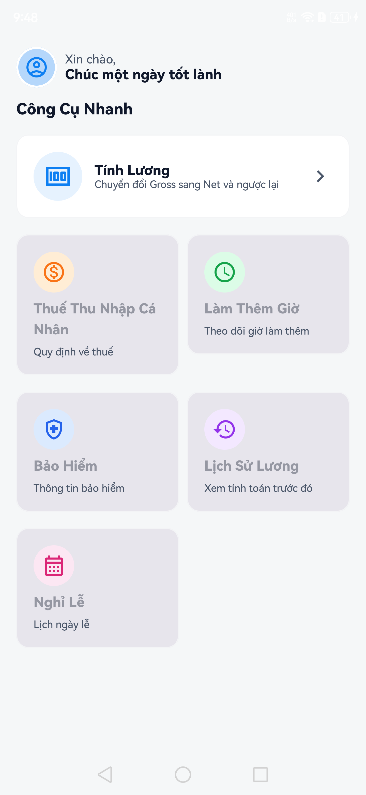
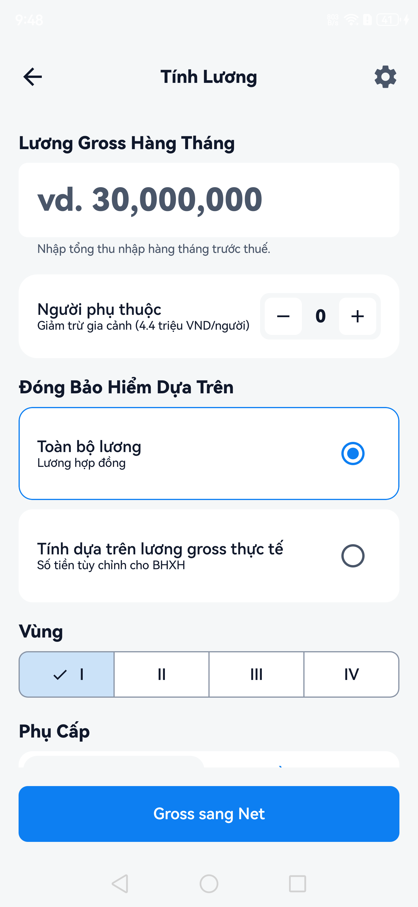
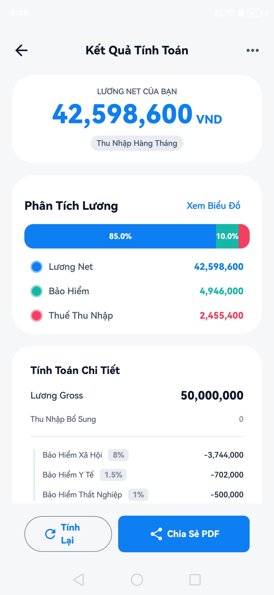
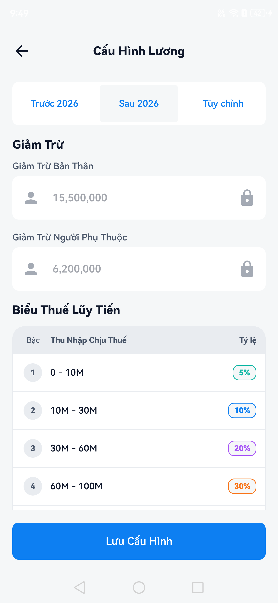

<a name="readme-top"></a>

<br />
<div align="center">
  <a href="https://github.com/phatndt/xsmart-kmm">
    
  </a>

  <h3 align="center">X Smart</h3>
  <p align="center">
    A comprehensive utility application built with Kotlin Multiplatform Mobile
    <br />
    <br />
    <a href="https://github.com/phatndt/xsmart-kmm/issues">Report Bug</a>
    ·
    <a href="https://github.com/phatndt/xsmart-kmm/issues">Request Feature</a>
  </p>
</div>

---

## 📚 Table of Contents

<details>
  <summary>Click to expand</summary>
  
  - [About The Project](#about-the-project)
  - [Features](#features)
  - [Architecture](#architecture)
  - [Tech Stack](#tech-stack)
  - [Getting Started](#getting-started)
    - [Prerequisites](#prerequisites)
    - [Installation](#installation)
    - [Running the Project](#running-the-project)
  - [Project Structure](#project-structure)
  - [Roadmap](#roadmap)
  - [Contributing](#contributing)
  - [Contact](#contact)
  - [Acknowledgments](#acknowledgments)
  - [License](#license)
</details>

---

## 🎯 About The Project

**X Smart** is a modern, feature-rich utility application designed to simplify everyday calculations and conversions. Built with Kotlin Multiplatform Mobile (KMM), the app demonstrates clean architecture principles and modern Android development practices.

The application features a clean, intuitive user interface inspired by modern design principles, providing users with quick access to essential tools including health metrics calculation, currency conversion, and Vietnam salary calculations.

**Design Inspiration:** [X Smart Mobile App on Behance](https://www.behance.net/gallery/66254549/X-Smart-Mobile-App)

<p align="right">(<a href="#readme-top">back to top</a>)</p>

---

## ✨ Features

### 📊 Dashboard
- **Feature Overview** showing all available tools
- **Quick Access** to commonly used features
- **Modern UI** with Material Design 3 components
- **Dark Mode Support** for comfortable viewing

<div align="center">
  
</div>

### 💰 Vietnam Salary Calculator
- **Net Salary Calculation** based on gross income
- **Tax Breakdown** with detailed calculations
- **Insurance Deductions** (Social, Health, Unemployment)
- **Regional Salary Support** with area-specific calculations
- **Configurable Tax Brackets** and deduction rules
- **Multiple Calculation Modes** (Standard and Custom)
- **Detailed Results View** showing all deduction components

<table align="center">
  <tr>
    <td></td>
    <td></td>
    <td></td>
  </tr>
</table>

### 🌐 Localization
- **Vietnamese (VI)** - Default language
- **English (EN)** - Full translation support
- **Easy Language Switching** in app settings

<p align="right">(<a href="#readme-top">back to top</a>)</p>

---

## 🏗️ Architecture

The project follows **Clean Architecture** principles with a modular structure:

```
┌─────────────────────────────────┐
│     Presentation Layer          │
│  (Jetpack Compose + MVVM)       │
├─────────────────────────────────┤
│      Domain Layer               │
│    (Use Cases + Models)         │
├─────────────────────────────────┤
│       Data Layer                │
│  (Repositories + Data Sources)  │
└─────────────────────────────────┘
```

### Key Architectural Decisions

- **MVVM Pattern**: UI state management with ViewModel
- **Unidirectional Data Flow**: Using MVI-inspired patterns with UiState, UiIntent, and UiEffect
- **Dependency Injection**: Koin for DI across all layers
- **Kotlin Multiplatform**: Shared business logic across platforms
- **Repository Pattern**: Abstraction over data sources
- **Use Case Pattern**: Single responsibility for business operations

<p align="right">(<a href="#readme-top">back to top</a>)</p>

---

## 🛠️ Tech Stack

### Mobile Development
- **[Kotlin Multiplatform Mobile (KMM)](https://kotlinlang.org/lp/multiplatform/)** - Share business logic between Android and iOS
- **[Jetpack Compose](https://developer.android.com/jetpack/compose)** - Modern declarative UI for Android
- **Material Design 3** - Latest Material Design guidelines

### Architecture & Patterns
- **MVVM** - Model-View-ViewModel architecture pattern
- **Clean Architecture** - Separation of concerns with distinct layers
- **MVI-Inspired State Management** - Predictable state management

### Dependency Injection
- **[Koin](https://insert-koin.io/)** - Kotlin-first dependency injection framework

### Networking
- **[Ktor Client](https://ktor.io/)** - Type-safe HTTP client for Kotlin Multiplatform

### Database
- **[SQLDelight](https://cashapp.github.io/sqldelight/)** - Type-safe SQL database library for KMM

### Asynchronous Programming
- **[Kotlin Coroutines](https://kotlinlang.org/docs/coroutines-overview.html)** - Asynchronous programming
- **[Kotlin Flow](https://kotlinlang.org/docs/flow.html)** - Reactive streams for Kotlin

### Build System
- **Gradle with Kotlin DSL** - Type-safe build configuration

<p align="right">(<a href="#readme-top">back to top</a>)</p>

---

## 🚀 Getting Started

### Prerequisites

Before running the project, ensure you have the following installed:

- **Android Studio** (latest stable version - Arctic Fox or later recommended)
- **JDK 11** or higher
- **Kotlin** 1.9.0 or higher
- **Android SDK** with minimum API level 24
- For iOS development (optional):
  - **macOS** with Xcode installed
  - **CocoaPods** for dependency management

### Installation

1. **Clone the repository**
   ```sh
   git clone https://github.com/phatndt/xsmart-kmm.git
   cd xsmart-kmm
   ```

2. **Open the project in Android Studio**
   - Launch Android Studio
   - Select "Open an Existing Project"
   - Navigate to the cloned directory and open it

3. **Sync Gradle dependencies**
   - Android Studio will automatically prompt you to sync
   - If not, click on "File" → "Sync Project with Gradle Files"

### Running the Project

#### Android
1. Connect an Android device or start an emulator
2. Select the `androidApp` configuration
3. Click the "Run" button or press `Shift + F10`

#### iOS (Future Support)
> Note: iOS implementation is currently not available but is planned for future releases.

<p align="right">(<a href="#readme-top">back to top</a>)</p>

---

## 📁 Project Structure

```
xsmart/
├── androidApp/              # Android application module
│   ├── src/main/           
│   │   ├── java/           # Android-specific code
│   │   └── res/            # Android resources
│   └── build.gradle.kts
│
├── feature/                # Feature modules
│   ├── dashboard/          # Dashboard feature
│   └── salarycalculator/   # Vietnam salary calculator feature
│
├── share/                  # Shared KMM modules
│   ├── data/              # Data layer (repositories, data sources)
│   ├── domain/            # Domain layer (use cases, models)
│   └── di/                # Dependency injection modules
│
├── iosApp/                # iOS application (future)
├── buildSrc/              # Build configuration
└── build.gradle.kts       # Root build configuration
```

### Module Overview

- **`androidApp`**: Android application entry point with UI implementation
- **`feature/*`**: Modularized features following single responsibility
- **`share/data`**: Data sources, repositories, and data models
- **`share/domain`**: Business logic, use cases, and domain models
- **`share/di`**: Koin modules for dependency injection

<p align="right">(<a href="#readme-top">back to top</a>)</p>

---

## 🗺️ Roadmap

### Current Version Features
- [x] Dashboard with feature overview
- [x] Vietnam Salary Calculator
- [x] Dark mode support
- [x] Vietnamese and English localization

### Planned Features
- [ ] BMI Calculator with history tracking
- [ ] Currency Converter with real-time rates
- [ ] Unit Converter (length, weight, temperature, etc.)
- [ ] Compass feature
- [ ] User authentication and cloud sync
- [ ] iOS application implementation
- [ ] Offline mode improvements
- [ ] Export calculation results
- [ ] Widget support
- [ ] Customizable themes
- [ ] More language support

See the [open issues](https://github.com/phatndt/xsmart-kmm/issues) for a full list of proposed features and known issues.

<p align="right">(<a href="#readme-top">back to top</a>)</p>

---

## 🤝 Contributing

Contributions are what make the open source community amazing! Any contributions you make are **greatly appreciated**.

If you have a suggestion that would make this better:

1. Fork the Project
2. Create your Feature Branch (`git checkout -b feature/AmazingFeature`)
3. Commit your Changes (`git commit -m 'Add some AmazingFeature'`)
4. Push to the Branch (`git push origin feature/AmazingFeature`)
5. Open a Pull Request

<p align="right">(<a href="#readme-top">back to top</a>)</p>

---

## 📧 Contact

**Phat Nguyen**

- LinkedIn: [@phatndt](https://www.linkedin.com/in/phatndt/)
- Email: phatndt2109@gmail.com
- GitHub: [@phatndt](https://github.com/phatndt)

**Project Link**: [xsmart-kmm](https://github.com/phatndt/xsmart-kmm)

<p align="right">(<a href="#readme-top">back to top</a>)</p>

---

## 🙏 Acknowledgments

Special thanks to the following resources and tools that made this project possible:

### Frameworks & Libraries
- [Kotlin Multiplatform Mobile](https://kotlinlang.org/lp/multiplatform/) - Cross-platform development
- [Jetpack Compose](https://developer.android.com/jetpack/compose) - Modern UI toolkit
- [Koin](https://insert-koin.io/) - Dependency injection
- [SQLDelight](https://cashapp.github.io/sqldelight/) - Type-safe database
- [Ktor](https://ktor.io/) - HTTP client
- [Kotlin Coroutines & Flow](https://kotlinlang.org/docs/flow.html) - Asynchronous programming

### Design & Inspiration
- [X Smart UI/UX Design on Behance](https://www.behance.net/gallery/66254549/X-Smart-Mobile-App)
- [Material Design 3](https://m3.material.io/)

### Community
- [Kotlin Community](https://kotlinlang.org/community/)
- [Android Developers](https://developer.android.com/)

<p align="right">(<a href="#readme-top">back to top</a>)</p>

---

## 📄 License

This project is available for personal and educational use.

<p align="right">(<a href="#readme-top">back to top</a>)</p>
