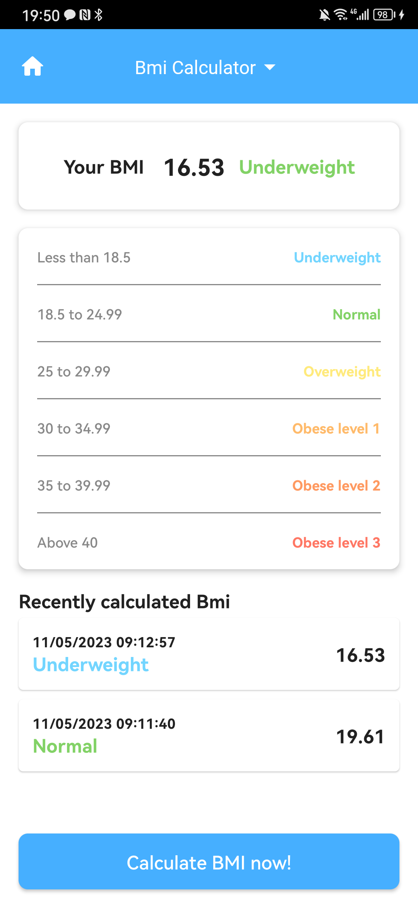
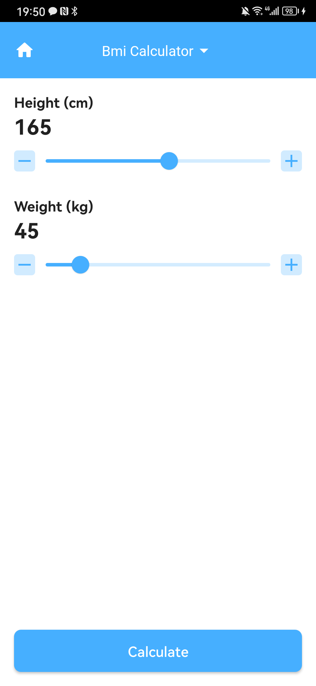
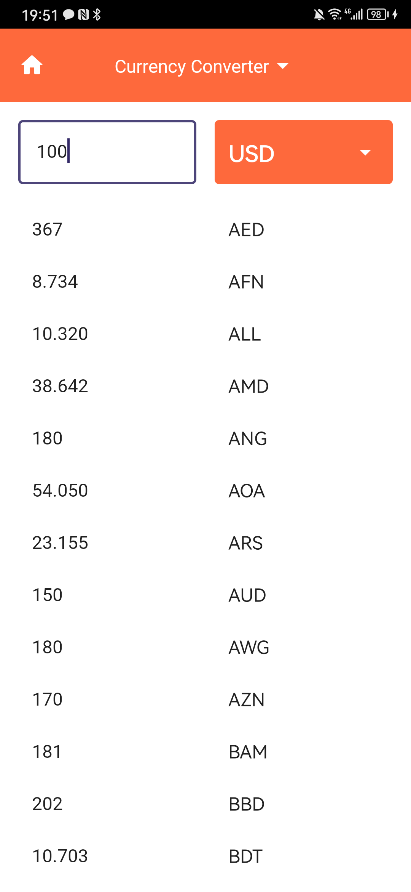
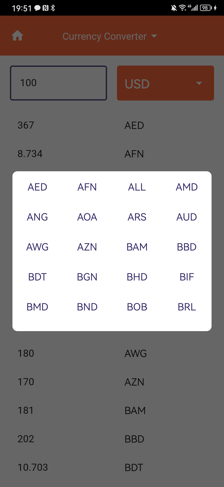

<a name="readme-top"></a>

<br />
<div align="center">
  <a href="https://github.com/othneildrew/Best-README-Template">
    
  </a>

  <h3 align="center">X Smart Application</h3>

</div>


<details>
  <summary>Table of Contents</summary>
  <ol>
    <li>
      <a href="#about-the-project">About The Project</a>
      <ul>
        <li><a href="#built-with">Built With</a></li>
      </ul>
    </li>
    <li>
      <a href="#getting-started">Getting Started</a>
      <ul>
        <li><a href="#installation">Installation</a></li>
      </ul>
    </li>
    <li><a href="#usage">Usage</a></li>
    <li><a href="#roadmap">Roadmap</a></li>
    <li><a href="#contact">Contact</a></li>
    <li><a href="#acknowledgments">Acknowledgments</a></li>
  </ol>
</details>


<!-- ABOUT THE PROJECT -->
## About The Project

X Smart Application is a unit converter A simple with clean user interface. It includes a favorites list for easy access to commmonly used conversions. 

UI/UX based on https://www.behance.net/gallery/66254549/X-Smart-Mobile-App

<p align="right">(<a href="#readme-top">back to top</a>)</p>


### Built With

* Project base Kotlin multiplatform mobile (share data and domain layer)
* Android clean architecture (no usecase/interactor)
* Android: Jetpack compose, MVVM architecture pattern,...
* Ios: not implementation
* Share module: Kotlin coroutine and Kotlin flow (asynchronous), Ktor (network calling), Koin (dependency inject), Sqldelight (local storage),...

<p align="right">(<a href="#readme-top">back to top</a>)</p>


<!-- GETTING STARTED -->
## Getting Started

### Installation

1. Clone the repo
   ```sh
   git clone https://github.com/phatndt/xsmart-kmm.git
   ```
2. Run project

<p align="right">(<a href="#readme-top">back to top</a>)</p>


<!-- USAGE EXAMPLES -->
## Usage

### 1. Bmi calculator
- Home screen: You click the card on the top to show bmi rating. You click button on the bottom to navigate to the calculate screen. If you have bmi calculator history, it will be show below the card
- Calculate screenL: You can adjust the height and weight selection by swipe the slider or click minus/plus button. You can click the calculate button to conduct calculate your bmi.

<div align="center">
  
  
</div>

### 2. Currency convert
- Home screen: You can click the orange button to select the currency. You can input the amount in the text field on the left. When you input the amount. The exchange rate of all currency that can be converted will be shown on the list below.

<div align="center">
  
  
</div>

<p align="right">(<a href="#readme-top">back to top</a>)</p>


<!-- ROADMAP -->
## Roadmap

- [ ] Delete bmi history
- [ ] Save currency converter history
- [ ] Authentication
- [ ] Compass
- [ ] Unit converter


<p align="right">(<a href="#readme-top">back to top</a>)</p>


## Contact

Phat Nguyen - [linkedin](https://www.linkedin.com/in/phatndt/) - phatndt2109@gmail.com

Project Link: [xsmart-kmm](https://github.com/phatndt/xsmart-kmm)

<p align="right">(<a href="#readme-top">back to top</a>)</p>


<!-- ACKNOWLEDGMENTS -->
## Acknowledgments

Use this space to list resources you find helpful and would like to give credit to. I've included a few of my favorites to kick things off!

* [Kotlin multiplatform mobile](https://kotlinlang.org/lp/multiplatform/)
* [Koin](https://insert-koin.io/)
* [Sqldelight](https://cashapp.github.io/sqldelight/2.0.0-alpha05/)
* [Kotlin flow](https://kotlinlang.org/docs/flow.html)
* [Android compose](https://developer.android.com/jetpack/compose?gclid=CjwKCAjwpayjBhAnEiwA-7ena-Iwb6E3L2Prro98VX1AmGUkz_Ir6tGzZOFrq39jjOLUB_AlvFJ0dhoCX8MQAvD_BwE&gclsrc=aw.ds)
* [Ktor](https://ktor.io/)

<p align="right">(<a href="#readme-top">back to top</a>)</p>

