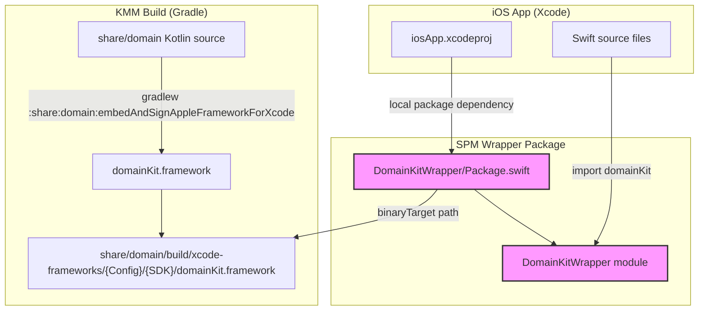
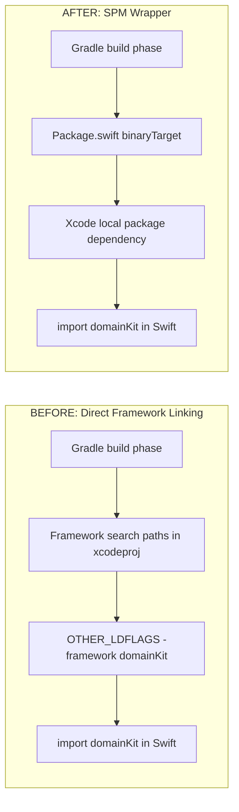
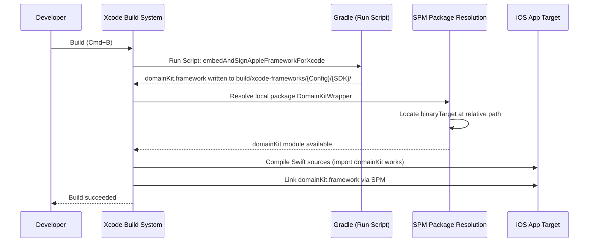
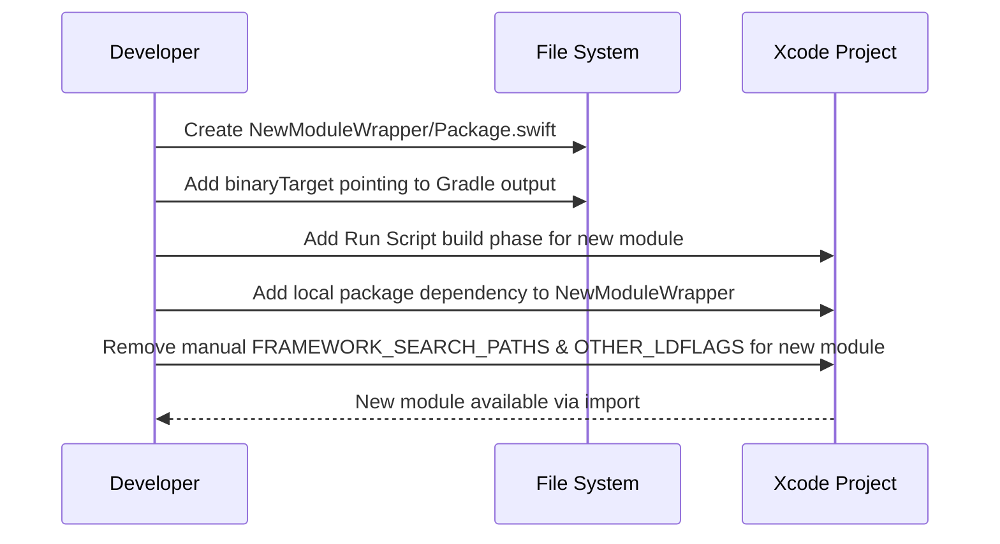

# Design Document: domainKit SPM Wrapper

## Overview

This feature creates a local Swift Package Manager (SPM) package that wraps the `domainKit` XCFramework produced by the KMM Gradle build. Instead of the iOS app linking `domainKit` directly via Xcode build phases, framework search paths, and `OTHER_LDFLAGS`, the app will consume `domainKit` through a local SPM package dependency.

The wrapper package acts as a thin bridge: it declares a binary target pointing at the Gradle-built framework output, and re-exports the module so downstream Swift code can `import DomainKit` (or continue using `import domainKit`) seamlessly. This modernizes dependency management, makes adding future KMM modules repeatable (each gets its own SPM wrapper), and aligns with Apple's recommended dependency tooling.

The same pattern can later be applied to `commonKit` and any future KMM shared modules, but this design focuses solely on `domainKit` as the first migration.

## Architecture



### Before vs After



## Sequence Diagrams

### Build Flow with SPM Wrapper



### Adding a New KMM Module (Future Pattern)



## Components and Interfaces

### Component 1: DomainKitWrapper Package (Package.swift)

**Purpose**: Declares a local Swift package that exposes the Gradle-built `domainKit.framework` as an SPM binary target, allowing Xcode to resolve it as a package dependency rather than requiring manual framework search paths and linker flags.

**Interface**:
```swift
// DomainKitWrapper/Package.swift
import PackageDescription

let package = Package(
    name: "DomainKitWrapper",
    platforms: [.iOS(.v14)],
    products: [
        .library(
            name: "DomainKitWrapper",
            targets: ["domainKit"]
        ),
    ],
    targets: [
        .binaryTarget(
            name: "domainKit",
            path: "../share/domain/build/xcode-frameworks/Release/iphoneos/domainKit.framework"
        ),
    ]
)
```

**Responsibilities**:
- Declare the binary target pointing to the Gradle-built framework location
- Expose the framework as an SPM library product
- Set the minimum platform to iOS 14 to match the app's deployment target
- Handle the path resolution from the package's location to the framework output directory

**Key Design Decision — Path Strategy**:

The `binaryTarget(path:)` in SPM resolves relative to the `Package.swift` file location. Since the Gradle build outputs to a configuration-specific path (`Debug/iphoneos`, `Release/iphoneos`, etc.), we need a strategy to handle this:

**Option A — Static path with build-configuration awareness** (Recommended):
Use a helper script that creates a symlink from a stable path to the active configuration's output before SPM resolution. The Gradle Run Script build phase already runs before compilation, so we extend it to also create a symlink.

**Option B — Direct path to a known configuration**:
Point at a fixed configuration (e.g., `Release/iphoneos`). Simpler but breaks when building Debug.

**Option C — Use `.xcframework` instead of `.framework`**:
Modify the Gradle build to produce an XCFramework (fat framework for all platforms/architectures). This is the cleanest long-term solution but requires changes to the KMM Gradle configuration.

**Recommended approach**: Option A for immediate implementation, with a migration path to Option C.

### Component 2: Symlink Script (Build Phase Enhancement)

**Purpose**: Ensures a stable framework path exists for SPM to resolve, regardless of the active Xcode build configuration (Debug/Release) and SDK (iphoneos/iphonesimulator).

**Interface**:
```bash
#!/bin/sh
# Added to the existing domainKit Run Script build phase

# Build the framework (existing)
cd "$SRCROOT/.."
./gradlew :share:domain:embedAndSignAppleFrameworkForXcode

# Create stable symlink for SPM (new)
FRAMEWORK_OUTPUT="$SRCROOT/../share/domain/build/xcode-frameworks/$CONFIGURATION/$SDK_NAME"
STABLE_LINK="$SRCROOT/../share/domain/build/xcode-frameworks/current"

rm -f "$STABLE_LINK"
ln -sf "$FRAMEWORK_OUTPUT" "$STABLE_LINK"
```

**Responsibilities**:
- Run after Gradle builds the framework
- Create/update a `current` symlink pointing to the active configuration's framework output
- Ensure the symlink is always fresh (remove before recreating)

### Component 3: Xcode Project Configuration Changes

**Purpose**: Migrate the iOS app from direct framework linking to SPM-based dependency on the wrapper package.

**Responsibilities**:
- Add `DomainKitWrapper` as a local package reference in the Xcode project
- Add `DomainKitWrapper` (or `domainKit`) as a package product dependency on the `iosApp` target
- Remove `domainKit`-specific entries from `FRAMEWORK_SEARCH_PATHS` (keep `commonKit` paths)
- Remove `-framework domainKit` from `OTHER_LDFLAGS` (keep `-framework commonKit`)
- Keep the existing Run Script build phase for `domainKit` (still needed to build the framework via Gradle) but enhance it with the symlink step
- Ensure the Run Script phase runs before SPM package resolution

## Data Models

### Package.swift Configuration Model

```swift
// The Package.swift is the sole configuration artifact.
// Its structure follows SPM conventions:

struct PackageConfig {
    let name: String                    // "DomainKitWrapper"
    let platforms: [SupportedPlatform]  // [.iOS(.v14)]
    let products: [Product]             // [.library(name:targets:)]
    let targets: [Target]               // [.binaryTarget(name:path:)]
}
```

**Validation Rules**:
- `name` must be a valid Swift module identifier
- `platforms` must include `.iOS(.v14)` or higher to match the app's deployment target
- The `binaryTarget` path must resolve to a valid `.framework` or `.xcframework` bundle
- The product's `targets` array must reference the binary target by its exact `name`

### File System Layout

```
project-root/
├── iosApp/                              # Xcode project root (SRCROOT)
│   ├── iosApp.xcodeproj/
│   ├── iosApp/
│   │   ├── iOSApp.swift
│   │   ├── ContentView.swift            # import domainKit continues to work
│   │   └── ...
│   └── DomainKitWrapper/                # NEW: Local SPM package
│       └── Package.swift
├── share/
│   └── domain/
│       └── build/
│           └── xcode-frameworks/
│               ├── Debug/
│               │   ├── iphoneos/
│               │   │   └── domainKit.framework
│               │   └── iphonesimulator/
│               │       └── domainKit.framework
│               ├── Release/
│               │   ├── iphoneos/
│               │   │   └── domainKit.framework
│               │   └── iphonesimulator/
│               │       └── domainKit.framework
│               └── current -> Debug/iphoneos/  # NEW: Symlink
└── ...
```


## Key Functions with Formal Specifications

### Function 1: Package.swift Binary Target Resolution

```swift
// Package.swift — DomainKitWrapper
import PackageDescription

let package = Package(
    name: "DomainKitWrapper",
    platforms: [.iOS(.v14)],
    products: [
        .library(
            name: "DomainKitWrapper",
            targets: ["domainKit"]
        ),
    ],
    targets: [
        .binaryTarget(
            name: "domainKit",
            // Path is relative to this Package.swift file.
            // Resolves to: iosApp/../share/domain/build/xcode-frameworks/current/domainKit.framework
            path: "../../share/domain/build/xcode-frameworks/current/domainKit.framework"
        ),
    ]
)
```

**Preconditions:**
- The Gradle Run Script build phase has completed successfully
- `domainKit.framework` exists at the resolved path
- The `current` symlink has been created/updated by the enhanced build script
- The framework is built for the active architecture (arm64 for device, x86_64/arm64 for simulator)

**Postconditions:**
- SPM resolves the binary target and makes `domainKit` module available for import
- Swift source files can use `import domainKit` without any `FRAMEWORK_SEARCH_PATHS`
- The framework is linked automatically by SPM (no manual `OTHER_LDFLAGS` needed)

### Function 2: Enhanced Gradle Build Script

```bash
#!/bin/sh
# Enhanced Run Script build phase for domainKit

# Guard: skip if IDE override is set
if [ "YES" = "$OVERRIDE_KOTLIN_BUILD_IDE_SUPPORTED" ]; then
    echo "Skipping Gradle build task invocation due to OVERRIDE_KOTLIN_BUILD_IDE_SUPPORTED"
    exit 0
fi

# Step 1: Build the framework (existing behavior)
cd "$SRCROOT/.."
./gradlew :share:domain:embedAndSignAppleFrameworkForXcode

# Step 2: Create stable symlink for SPM resolution (new)
FRAMEWORK_DIR="$SRCROOT/../share/domain/build/xcode-frameworks"
ACTIVE_OUTPUT="$FRAMEWORK_DIR/$CONFIGURATION/$SDK_NAME"
STABLE_LINK="$FRAMEWORK_DIR/current"

# Ensure the output directory exists
if [ ! -d "$ACTIVE_OUTPUT" ]; then
    echo "error: domainKit framework not found at $ACTIVE_OUTPUT"
    exit 1
fi

# Atomically update the symlink
rm -f "$STABLE_LINK"
ln -sf "$ACTIVE_OUTPUT" "$STABLE_LINK"

echo "domainKit SPM symlink updated: current -> $CONFIGURATION/$SDK_NAME"
```

**Preconditions:**
- `SRCROOT` is set by Xcode (points to `iosApp/` directory)
- `CONFIGURATION` is set by Xcode (`Debug` or `Release`)
- `SDK_NAME` is set by Xcode (`iphoneos` or `iphonesimulator`)
- Gradle and JDK are available on the build machine
- The KMM project has been configured with `./gradlew build` at least once

**Postconditions:**
- `domainKit.framework` is built and signed for the active configuration/SDK
- A symlink at `share/domain/build/xcode-frameworks/current` points to the active output
- The symlink target contains a valid `domainKit.framework` bundle
- If the framework build fails, the script exits with error (no stale symlink)

**Loop Invariants:** N/A (sequential script)

### Function 3: Xcode Project Modification

```swift
// Conceptual representation of pbxproj changes

// REMOVE from Debug & Release XCBuildConfiguration:
// FRAMEWORK_SEARCH_PATHS: remove domainKit entry, keep commonKit
//   Before: ("$(SRCROOT)/../share/common/build/...", "$(SRCROOT)/../share/domain/build/...")
//   After:  ("$(SRCROOT)/../share/common/build/...")

// REMOVE from Debug & Release XCBuildConfiguration:
// OTHER_LDFLAGS: remove -framework domainKit, keep -framework commonKit
//   Before: ("$(inherited)", "-framework", "commonKit", "-framework", "domainKit")
//   After:  ("$(inherited)", "-framework", "commonKit")

// ADD to PBXProject:
// packageReferences: add XCLocalSwiftPackageReference to DomainKitWrapper
//   path: "DomainKitWrapper"

// ADD to PBXNativeTarget (iosApp):
// packageProductDependencies: add reference to domainKit product from DomainKitWrapper
```

**Preconditions:**
- `iosApp.xcodeproj/project.pbxproj` is a valid Xcode project file
- The `DomainKitWrapper/Package.swift` file exists at the expected location
- The `commonKit` framework entries remain untouched

**Postconditions:**
- `domainKit` is no longer in `FRAMEWORK_SEARCH_PATHS` for any build configuration
- `domainKit` is no longer in `OTHER_LDFLAGS` for any build configuration
- `DomainKitWrapper` appears as a local package reference in the project
- The `iosApp` target has a package product dependency on `domainKit` from `DomainKitWrapper`
- `commonKit` entries in `FRAMEWORK_SEARCH_PATHS` and `OTHER_LDFLAGS` are unchanged
- `import domainKit` continues to compile in all Swift source files

## Algorithmic Pseudocode

### Build Order Algorithm

```pascal
ALGORITHM buildWithSPMWrapper
INPUT: Xcode build trigger (Cmd+B or CI)
OUTPUT: Compiled iOS app with domainKit linked via SPM

BEGIN
  // Phase 1: Run Script build phases (ordered before Sources)
  EXECUTE commonKit_gradle_build_phase
    // ./gradlew :share:common:embedAndSignAppleFrameworkForXcode
  
  EXECUTE domainKit_gradle_build_phase
    // ./gradlew :share:domain:embedAndSignAppleFrameworkForXcode
    // + symlink creation (new)
  
  ASSERT EXISTS("share/domain/build/xcode-frameworks/current/domainKit.framework")
  
  // Phase 2: SPM package resolution
  RESOLVE local_package("DomainKitWrapper")
    // SPM reads Package.swift
    // SPM resolves binaryTarget path via symlink
    // SPM makes domainKit module available
  
  ASSERT MODULE_AVAILABLE("domainKit")
  
  // Phase 3: Compile sources
  COMPILE swift_sources
    // import domainKit resolves via SPM
    // import commonKit resolves via FRAMEWORK_SEARCH_PATHS (unchanged)
  
  // Phase 4: Link frameworks
  LINK frameworks
    // domainKit linked by SPM automatically
    // commonKit linked by OTHER_LDFLAGS (unchanged)
  
  RETURN compiled_app
END
```

### Migration Algorithm (Manual Steps)

```pascal
ALGORITHM migrateToSPMWrapper
INPUT: Current Xcode project with direct framework linking
OUTPUT: Xcode project using SPM wrapper for domainKit

BEGIN
  // Step 1: Create the wrapper package
  CREATE_FILE "iosApp/DomainKitWrapper/Package.swift"
    WITH binaryTarget pointing to "../../share/domain/build/xcode-frameworks/current/domainKit.framework"
  
  // Step 2: Enhance the build script
  MODIFY run_script_phase("domainKit")
    APPEND symlink_creation_commands
  
  // Step 3: Add package to Xcode project
  ADD local_package_reference("DomainKitWrapper") TO xcode_project
  ADD package_product_dependency("domainKit") TO target("iosApp")
  
  // Step 4: Clean up old direct linking
  FOR EACH config IN [Debug, Release] DO
    REMOVE "share/domain/build/xcode-frameworks" FROM config.FRAMEWORK_SEARCH_PATHS
    REMOVE "-framework domainKit" FROM config.OTHER_LDFLAGS
    
    // Verify commonKit entries are preserved
    ASSERT CONTAINS(config.FRAMEWORK_SEARCH_PATHS, "share/common/build/xcode-frameworks")
    ASSERT CONTAINS(config.OTHER_LDFLAGS, "-framework commonKit")
  END FOR
  
  // Step 5: Verify
  BUILD project
  ASSERT BUILD_SUCCEEDS
  ASSERT "import domainKit" COMPILES in all Swift files
  
  RETURN migrated_project
END
```

## Example Usage

### Consuming domainKit After Migration

```swift
// iosApp/ContentView.swift — no changes needed
import SwiftUI
import commonKit   // Still via direct framework linking
import domainKit   // Now resolved via SPM wrapper (transparent to consumer)

struct ContentView: View {
    let greet = "Hello world, 2026!"

    var body: some View {
        Text(greet)
    }
}
```

### Adding a Future KMM Module (Pattern Replication)

```swift
// iosApp/CommonKitWrapper/Package.swift — same pattern for commonKit
import PackageDescription

let package = Package(
    name: "CommonKitWrapper",
    platforms: [.iOS(.v14)],
    products: [
        .library(
            name: "CommonKitWrapper",
            targets: ["commonKit"]
        ),
    ],
    targets: [
        .binaryTarget(
            name: "commonKit",
            path: "../../share/common/build/xcode-frameworks/current/commonKit.framework"
        ),
    ]
)
```

## Correctness Properties

1. **Import Transparency**: For all Swift source files `f` in the project, if `f` contains `import domainKit` before migration, then `f` compiles without modification after migration.

2. **Build Determinism**: For all build configurations `c ∈ {Debug, Release}` and SDKs `s ∈ {iphoneos, iphonesimulator}`, the symlink at `current` always points to the framework built for `(c, s)` at the time of compilation.

3. **Isolation**: Modifying the `DomainKitWrapper` package does not affect `commonKit` resolution. The `commonKit` framework search paths and linker flags remain unchanged.

4. **Path Validity**: The `binaryTarget(path:)` in `Package.swift`, when resolved relative to the `Package.swift` location, points to a directory that contains a valid `.framework` bundle after the Run Script phase completes.

5. **Idempotent Symlink**: Running the enhanced build script multiple times with the same `CONFIGURATION` and `SDK_NAME` produces the same symlink target. Running it with different values updates the symlink correctly.

6. **No Regression**: The set of public symbols available via `import domainKit` after migration is identical to the set available before migration.

## Error Handling

### Error Scenario 1: Framework Not Built Before SPM Resolution

**Condition**: Xcode attempts to resolve the SPM package before the Gradle Run Script phase completes (e.g., on first project open or after cleaning derived data).
**Response**: SPM will report "missing binary target" or "invalid framework at path". The `current` symlink won't exist.
**Recovery**: Build the project once (Cmd+B). The Run Script phase will execute Gradle, create the framework, and establish the symlink. Subsequent SPM resolutions will succeed. Alternatively, run `./gradlew :share:domain:embedAndSignAppleFrameworkForXcode` manually from the terminal, then create the symlink manually.

### Error Scenario 2: Stale Symlink After Configuration Change

**Condition**: Developer switches from Debug to Release (or device to simulator) but the symlink still points to the previous configuration's output.
**Response**: The framework may have the wrong architecture, causing linker errors.
**Recovery**: The enhanced build script always recreates the symlink before compilation. A clean build (Cmd+Shift+K, then Cmd+B) will resolve this. The script's `rm -f` + `ln -sf` pattern ensures no stale symlinks persist.

### Error Scenario 3: Gradle Build Failure

**Condition**: The Gradle task fails (Kotlin compilation error, missing JDK, etc.).
**Response**: The enhanced script checks for the framework directory's existence and exits with an error if missing. Xcode will show the build error in the build log.
**Recovery**: Fix the Kotlin source error, ensure JDK is installed, and rebuild.

### Error Scenario 4: Package.swift Path Mismatch

**Condition**: The `DomainKitWrapper/Package.swift` is moved to a different directory, breaking the relative path to the framework.
**Response**: SPM will fail to resolve the binary target.
**Recovery**: Update the `path` in `Package.swift` to reflect the new relative location. The path must always resolve from the `Package.swift` file's directory to `share/domain/build/xcode-frameworks/current/domainKit.framework`.

## Testing Strategy

### Unit Testing Approach

Since this feature is primarily about build infrastructure (no runtime code changes), traditional unit tests don't apply. Instead, validation focuses on build correctness:

1. **Build Smoke Test**: Clean build succeeds on both Debug and Release configurations
2. **Simulator Build**: Build for iOS Simulator (x86_64 and arm64) succeeds
3. **Device Build**: Build for physical device (arm64) succeeds
4. **Import Test**: A Swift file with `import domainKit` compiles without errors

### Integration Testing Approach

1. **Full Build Cycle**: From clean state, `./gradlew :share:domain:embedAndSignAppleFrameworkForXcode` followed by Xcode build succeeds
2. **Configuration Switch**: Build Debug, then build Release without cleaning — both succeed
3. **Symlink Verification**: After build, verify `current` symlink points to correct `$CONFIGURATION/$SDK_NAME`
4. **No Regression**: Existing `import commonKit` in `ContentView.swift` continues to work
5. **Symbol Availability**: Domain model types and use cases from `domainKit` are accessible in Swift code

### Property-Based Testing Approach

Not applicable for build infrastructure changes. Correctness is validated through the build smoke tests and the correctness properties defined above.

## Security Considerations

- The symlink creation uses `ln -sf` which follows standard Unix semantics — no symlink attack vector since the paths are deterministic and within the project directory
- The Gradle build phase already has the `OVERRIDE_KOTLIN_BUILD_IDE_SUPPORTED` guard, which is preserved
- No new network access is introduced (SPM resolves locally, no remote package fetches)
- Code signing is handled by the existing `embedAndSignAppleFrameworkForXcode` Gradle task

## Performance Considerations

- Build time impact is negligible: the symlink creation adds ~10ms to the build script
- SPM local package resolution is fast (no network fetch, no version resolution)
- The Gradle build phase timing is unchanged (it's the dominant cost and is unaffected)
- Incremental builds benefit slightly: SPM caches resolved packages, so the binary target is only re-evaluated when the framework changes

## Dependencies

- **Swift Package Manager**: Built into Xcode (no additional installation)
- **Xcode 12+**: Required for local SPM package support with binary targets (the project already uses Xcode 11.3+ features)
- **Gradle**: Already required for KMM framework builds (no change)
- **KMM Gradle plugin**: Already configured in the root project (no change)
- No new third-party dependencies are introduced
